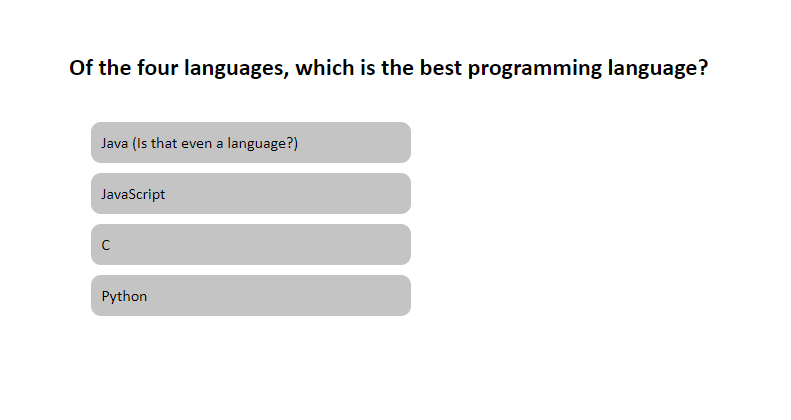

# Coding Quiz

## Table of Contents

1. [Introduction](#introduction)
2. [Developer Comments](#developer-comments)
3. [Deployed Application](#deployed-application)
4. [Creators](#creators)
5. [License](#license)

## Introduction

This is the Week 4 challenge of the edX/Monash Bootcamp.  The challenge was to create a quiz based on the Acceptance Criteria as follows:

`GIVEN I am taking a code quiz 
WHEN I click the start button 
THEN a timer starts and I am presented with a question 
WHEN I answer a question 
THEN I am presented with another question 
WHEN I answer a question incorrectly 
THEN time is subtracted from the clock 
WHEN all questions are answered or the timer reaches 0 
THEN the game is over 
WHEN the game is over 
THEN I can save my initials and score`

## Developer Comments
With this challenge I got a lot more experience using the localStorage API, used to store the user's initials and score. Also, the window API which is used to move from question to question in my application.  This project has many more lines of JavaScript code than my previous projects, and I'm beginning to see the importance of organising things a little better.  I think I could have done better at organising my code, and I'll be making note of this for the future challenges.  Often I would go to test something and I'd be rushing and wouldn't refactor my code... I would get side tracked and start the next feature.  I need to make it a habit to refactor my code after each feature and I'll be incorporating this process by making a commit dedicated to refactoring in the next challenge!

## Deployed Application

<https://x4ndez.github.io/coding-quiz/>

## Creators

**Xande** : <https://github.com/x4ndez>

## License

Code released under the MIT License.